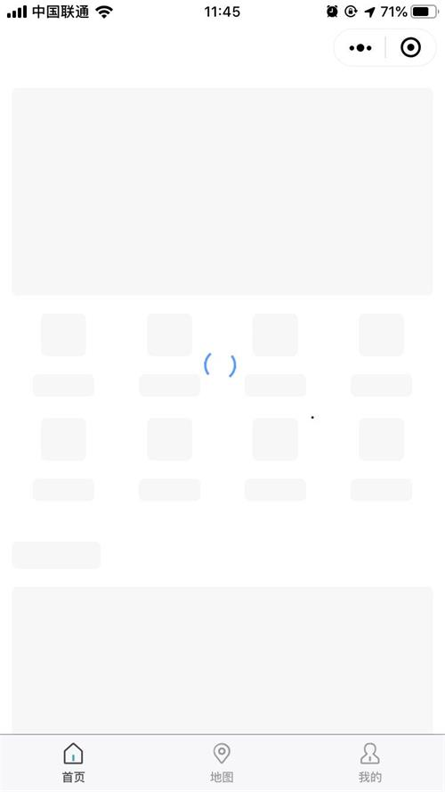

# 小程序骨架屏的探索

[参考文章](https://segmentfault.com/a/1190000015876164)

## 使用

```html
    // 引入
    usingComponents: {
        "skeleton": "/components/skeleton/skeleton"
    }
    <!--引入骨架屏模版 -->
    <skeleton wx:if="{{showSkeleton}}" selector="skeleton" loading="{{loading}}"></skeleton>
    <!-- 跟节点添加 skeleton -->
    <view class="container index skeleton" id="Index">
        <!--需要用到骨架屏的节点 S-->
        <image src="../../common/imgs/icon-golden.png" class="nav-icon skeleton-rect"></image>
        <view class="skeleton-rect">首页导航</view>
        <!--需要用到骨架屏的节点 E-->
    </view>
```

```javascript
    onLoad() {
        this.showSkeleton = false;   // 骨架屏显示隐藏
    }
```

showSkeleton用来控制骨架屏的隐藏和显示；




## 原理

获取到DOM节点和样式，覆盖样式，生成灰色块盖在原有文本、图片等节点上面。

[相关Api](https://developers.weixin.qq.com/miniprogram/dev/api/wxml/wx.createSelectorQuery.html)

```javascript
		wx.createSelectorQuery().selectAll(`.${this.data.selector} >>> .${this.data.selector}-rect`).boundingClientRect().exec(function(res){
        that.setData({
			skeletonRectLists: res[0]
			})
		});
```

- `wx.createSelectorQuery().selectAll` 选择匹配选择器 selector 的所有节点

- `boundingClientRect` 节点的布局位置的查询请求。相对于显示区域，以像素为单位。其功能类似于 DOM 的 getBoundingClientRect

- `exec` 执行所有的请求。请求结果按请求次序构成数组，在callback的第一个参数中返回。
         

```html
    <view wx:for="{{skeletonRectLists}}" wx:key="{{index}}" style="border-radius: 10rpx;width: {{item.width}}px; height: {{item.height}}px;position: absolute; left: {{item.left}}px; top: {{item.top}}px">
    </view>
```
